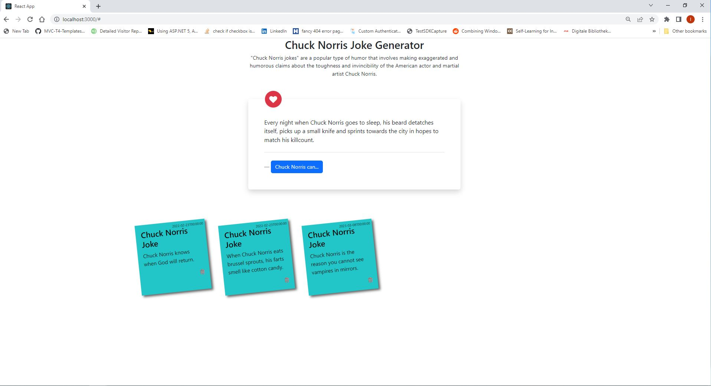

# IQBussiness Assessment - Chuck Norris Joke Generator

The front-end of this application is built using REACT and the back-end is built using ASP.NET Core. 
The way I went about it was to develop the REACT front-end for consuming the Chuck Norris API and generate the jokes, then went on to style the UI to be clean and user-friendly making use of bootstrap,font-awesome and jquery. I did this using Visual Studio Code
From there I then develop the Asp.Net Core Web API application on Visual Studio making use of .Net 6. I created a local database on SQL Server then used Entity Framework Core Database-First approach to connect to it. To follow some best practices I used a Repository Pattern for the Model to Controller communication and made the controller methods to asynchronous. 
I went back to the REACT to develop the communication with the back-end and to add to display the favourite jokes in a user friendly way. 
To optimize for performance the application, I used asynchronous programming, minimized the number of HTTP requests and also optimized the server-side rendering. 
To the Database for perfomance, I went back to work on the data types and make sure the least amount memory used for each. 

Instructions for setting up the database:
MS SQL Server:
  - Create Database
  - Create FavouriteJokes Table consisting of (Id int IDENTITY(1,1) NOT NULL), (TheJoke nvarchar(250) NOT NULL), (LikedOn datetime2](7) NOT NULL)
.Net Core Web API:
  - Add/create connection string and add it to appsettings.json 
  - use Scaffold-DbContext {connection string} Microsoft.EntityFrameworkCore.SqlServer -OutputDir Models
  - Add the connection string as a SQL service on the program.cs file 
